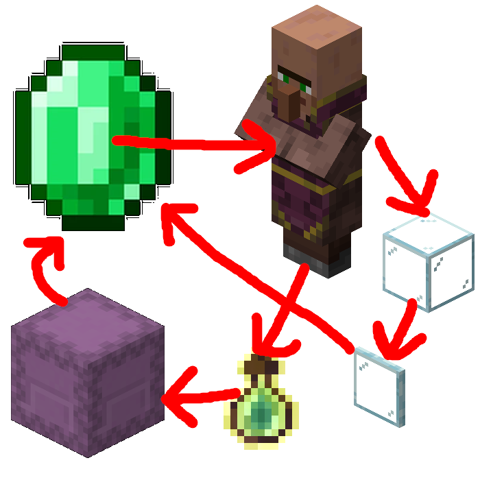

# TradeAura




Meteor addon that automates villager trading - buys and sells against rules you set, and can keep
your inventory itself tidy (drop, compress/decompress emeralds, dump to and refill from a shulker)
while it works. Includes manual auto trade (trade is completed automatically after a manual interaction with villager) and villager-aura (automatically clicks at villagers to perform trades)

### Features

- **Buy/sell rules**: pick items, set price/quantity limits per rule, trades complete automatically
  on interaction - no manual clicking through the trade list
- **Villager Aura**: automatically looks at and interacts with villagers in range, with configurable
  timing, movement lock near a villager, and unsynced-trade recovery
- **Inventory manipulation**: optional automatic dropping of excess items, emerald
  compress/decompress (and glass pane crafting), dumping to and refilling from a shulker - runs
  between trades, interrupts the aura while active
- **Render**: optional bounding-box overlay showing why a villager was or wasn't traded with
  (no emeralds, limit reached, too expensive, on cooldown, etc.), color-coded

### Requirements

- [Fabric Loader](https://fabricmc.net/use/)
- [Meteor Client](https://meteorclient.com/)

### Download

| Minecraft Version | Addon Version |
| --- | --- | 
| 26.1.2    | [26.1.2 (Latest)](https://github.com/DortyTheGreat/TradeAura/releases/latest) 
| 1.21.11   | [1.21.11](https://github.com/DortyTheGreat/TradeAura/releases/tag/1.21.11d)    
| 1.21.4    | [1.21.4](https://github.com/DortyTheGreat/TradeAura/releases/tag/1.21.4d)    

> **Note**
> * Only the latest Minecraft version receives feature updates. Older releases may not include the newest features.
>   * TODO: This will probably be changed eventually and I will add support to multiple minecraft/meteor versions sometime in the future
> * Releases are generally **forward-compatible**, meaning each Addon version is expected to work on multiple newer Minecraft versions. However, this compatibility is not guaranteed indefinitely and may eventually break.

### Usage

1. Open the module GUI and add **Buy Rules** / **Sell Rules**: pick the items for each rule, then set
   its price/quantity limits (buy: max emerald price + inventory cap; sell: max sell quantity +
   emerald cap). A limit of `-1` means unlimited.
2. Turn the module on:
   - Click a villager manually, or enable **Villager-Aura** (Aura group) to have it click villagers
     in range for you.
   - Trades matching a rule complete automatically; the trade screen closes itself if **Close** is on.
3. Optionally configure **Inventory manipulation** (its own settings group) to keep excess items,
   emeralds, and shulker contents in check automatically between trades.
4. Enable **Render** (Render group) if you want a visual overlay explaining what the aura is doing
   with each villager.

### Settings

Settings are split into four groups in the module GUI:

| Group | Covers |
| --- | --- |
| General | `Close` / `Ticks-to-close` (auto-close the trade screen), `Cancel-Event` (suppress the trade GUI popping open), `Debug` (verbose chat logging). Buy/Sell rules themselves are edited as tables in the module GUI, not as individual settings. |
| Aura | Enable/tune `Villager-Aura`: click timing, rotation, range, target priority/limits, movement lock while a villager is in range, and recovery for villagers that never sync their trade offers. |
| Inventory manipulation | Independent toggles for dropping excess items, compressing/decompressing emeralds (+ glass panes), dumping to and refilling from a shulker - each with its own trigger/leave thresholds and per-item rule tables, plus shared settings for action pacing and shulker handling. |
| Render | `Render` toggle plus opacity and one color per outcome (no emeralds, no sellable items, no trades, on cooldown, too expensive, limit reached, successful purchase). |

### Showcase

https://github.com/user-attachments/assets/7e2bc3a1-4222-4728-956b-aa308c9296ab

### Building and running the game

```sh
./gradlew build                # build/libs/<name>-<version>.jar
./gradlew runClient            # launch with the mod loaded, empty run/ folder
./gradlew runInstance          # ...on your own PrismLauncher instance instead
./gradlew deploy               # build a jar, swap it into the PrismLauncher instance, restart
./gradlew runInstance -Pdebug  # suspend the game until a debugger attaches (F5 does this)
./gradlew buildArchive         # build a jar, also put a copy into releases/ folder
./gradlew tasks --group addon  # everything above, from Gradle itself
```

`runInstance` and `deploy` need `deploy.local.properties` - copy
`deploy.local.properties.example` and fill in your PrismLauncher paths.


### Version numbering

`AddonName-<mod_version>+<minecraft_version>.jar`, derived from
**git** so nothing is bumped by hand:

| situation | jar |
|---|---|
| on an exact tag, clean tree | `...-1.2.3+26.1.2.jar` |
| 7 commits past `v1.2.3` | `...-1.2.4-dev.7+26.1.2.jar` |
| ...with uncommitted changes | `...-1.2.4-dev.7d+26.1.2.jar` |

Releasing is `git tag v1.2.3` and building.


`gradle.properties`, which is the single source of truth read by
`settings.gradle.kts`, `build.gradle.kts` and (through `processResources`)
`fabric.mod.json`. `BuildConfig.java` is generated from it too, so the mod
name, category and repo are never written down twice.


## License

This mod is licensed under [GPL-3.0-or-later](LICENSE). Feel free to use, modify and redistribute it,
as long as derivative works stay under the same license.
